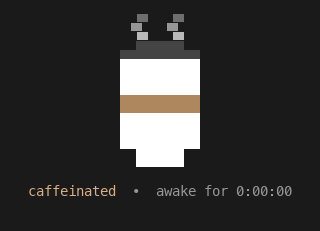

# cuppa ☕

Keep your Mac awake with a little animated paper coffee-cup pet in your terminal.

`cuppa` runs macOS's built-in `caffeinate` so your Mac won't idle-sleep, and
while it does, a tiny pixel-art cup steams away in the terminal with a live
"awake for HH:MM:SS" timer. Press `Ctrl+C` and it cleanly stops `caffeinate`
so your Mac can sleep again.



## Requirements

- **macOS** (uses the built-in `caffeinate`).
- **Python 3** — pre-installed if you have Xcode Command Line Tools
  (`xcode-select --install`) or Homebrew Python (`brew install python`).
  No third-party packages needed.

## Install

### From a clone (works now)

```bash
gh repo clone javirivera/cuppa
cd cuppa
make install            # installs to /usr/local/bin/cuppa
```

or run the installer directly:

```bash
./install.sh
```

### One-liner (once the repo is public)

```bash
curl -fsSL https://raw.githubusercontent.com/javirivera/cuppa/main/install.sh | bash
```

## Usage

```bash
cuppa                 # stay awake until you press Ctrl+C
cuppa -t 3600         # stay awake for 1 hour, then quit
cuppa -- -d -s        # pass extra flags straight to caffeinate (e.g. -d display, -s on AC)
cuppa --version
```

By default `cuppa` prevents **idle** sleep (`caffeinate -i`); the display may
still turn off. Anything after `--` is passed through to `caffeinate`.

## Uninstall

```bash
make uninstall                       # from a clone
# or
rm -f /usr/local/bin/cuppa
```

## Notes

- An experimental [Textual](https://textual.textualize.io/) UI version exists
  locally (`cuppa_tui.py`) but is intentionally **not** shipped — `cuppa` is a
  single zero-dependency file on purpose.
- The demo GIF is generated from the live sprite by `make_demo.py`
  (`pip install Pillow` first). Regenerate with `python3 make_demo.py`.

## License

[MIT](LICENSE) © 2026 Javier Rivera
